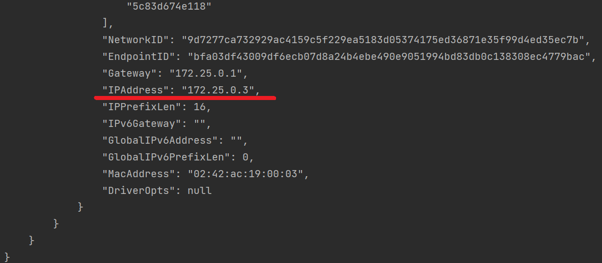

# Getting Started

This is recreated in the Kotlin and Spring Boot application for the Kotlin for Backend Developers mentoring program based on the provided requirements from the task description.

The service uses the [Dog CEO](https://dog.ceo/dog-api/) public API to obtain information about various dog breeds.

### REQUIREMENTS:

This implementation requires Docker to be installed with its tool, Docker Compose.
This is required because the database is created on a dockerized mySQL server and is set up at the start.

**First, inside the main folder, run the command 'docker compose up'.**  
mySQL server would be set up, and 'breed_db' database would be created. 
-With mySQL server, the phpAdmin client would be set up at localhost:9090. 
It's added if there is a need to inspect the database. 
 
**To log into phpAdmin, users have to:** 
    --run command: 'docker container ls', which would list all containers, 
    --next run: 'docker inspect [PASTE ID OF A mySQL SERVER FROM STEP BEFORE]'. This should print information about containers that are running, 
      along with its IP address. 

This address, along with the database username and password, is required information for the phpAdmin dashboard. 

**When this is set up, the user can run applications from the IDE, and under the access link http://localhost:8080/swagger-ui/.**  
**All endpoints should be displayed and ready for testing.**  
    

